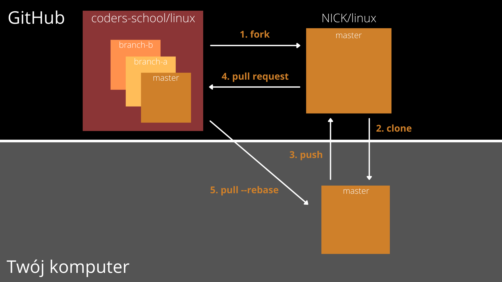

# Narzędzia programisty

## Git

### Modele pracy zdalnej

- Single Remote Single Branch (SRSB) - model pracy polecany tylko dla 1 osoby. Wszystkie zmiany znajdują się tylko na jednej gałęzi (zazwyczaj master). Łatwe do opanowania na start. Stosowane często w małych, osobistych projektach.
- Single Remote Multiple Branches (SRMB) - model pracy znany z systemu SVN (subversion). Często stosowany w korporacjach. Wszyscy developerzy wysyłają zmiany na to samo centralne repozytorium. Łatwy do zarządzania uprawnieniami. Kod mogą dostarczać tylko osoby, które są dodane do listy.
- Multiple Remotes Multiple Branch (MRMB) - model pracy znany z open-source w przypadku współprac grupowych. Kilka osób wspólnie rozwija nową funkcjonalność za pomocą Pull Requestów, która potem sama zostanie zgłoszona do złączenia z głównym repozytorium. Do tego modelu będziemy dążyć. Jego plusem jest konieczność zatwierdzania wszystkich zmian kodu, a więc obowiązkowe Code Review. Nie potrzeba też żadnej konfiguracji uprawnień. Każdy może dostarczać kod.

### Workflow

- Na stronie [kurs git\'a](https://kursgita.pl/) znajdziesz w materiałach demo lekcję o workflow w gicie.
- [Tutaj](pdf/workflow.pdf) znajdziesz omawianego PDFa z przykładem schematu workflow
- W większych projektach na masterze każdy commit powinien się kompilować i przechodzić wszystkie testy. Najlepiej nie commituj na niego bezpośrednio, tylko używaj Pull Requestów do dorzucania nowych funkcjonalności
- W malutkich jednoosobowych zadaniach czy projekcikach nie warto komplikować i używaj tylko mastera.
- Na branchach kod nie musi się kompilować. To twoje prywatne gałęzie, taka kopia zapasowa. Dlatego warto robić jak najczęstsze commity z każdą, najdrobniejszą nawet zmianą. Dzięki temu Twój zespół będzie mógł widzieć, nad czym pracujesz i zrobić Ci code review, czy ułatwić integrację. Podczas łączenia, można wybrać opcję Squash & Merge, dzięki czemu jeśli narobisz nawet 100 commitów to zmiany wejdą na mastera jako 1.

Standardowy przepływ pracy na GitHubie jeśli pracujesz samemu wygląda tak:

1. Forkujesz repozytorium, które chcesz zmodyfikować
2. Klonujesz forka na swój komputer
3. Dokonujesz potrzebnych zmian, robisz `git add`, `git commit` i wysyłasz zmiany na forka robiąc `git push`
4. Zgłaszasz pull request na GitHubie.

Jeśli coś jest nie tak, np. Twoja praca zawiera błędy to tylko powtarzasz krok 3. Zmieniasz co trzeba, dodajesz zmiany, tworzysz commit i robisz push. Zgłoszony Pull Request aktualizuje się
automatycznie.

Jeśli w oryginalnym repo (na obrazku coders-school/linux) zostało coś zmienione i chcesz sobie dociągnąć te zmiany, robisz `git pull --rebase https://github.com/coders-school/linux.git` (krok 5). Te zmiany musisz także wysłać na swojego forka za pomocą `git push`, gdyż forki same się nie aktualizują. Automatycznie aktualizują się tylko pull requesty.
