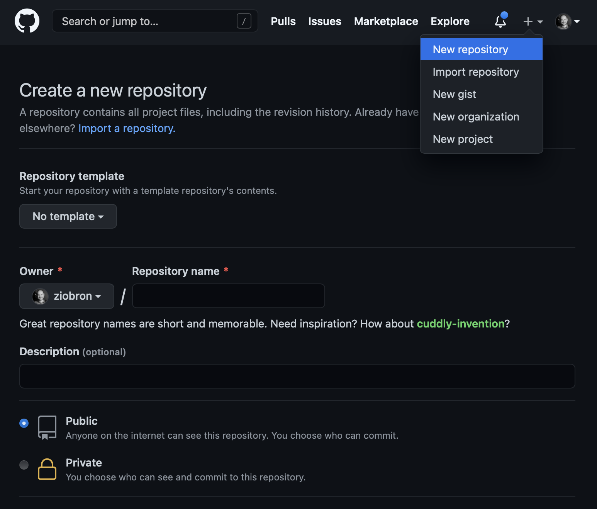
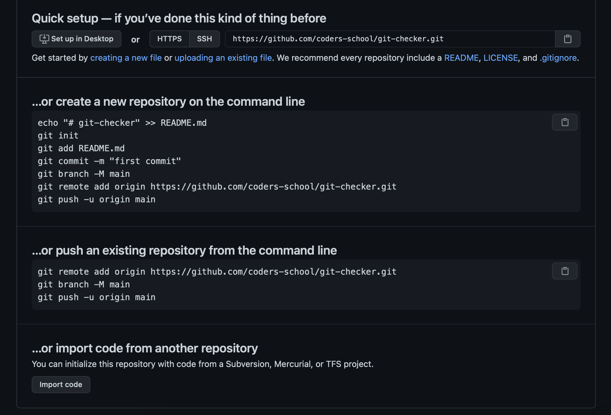
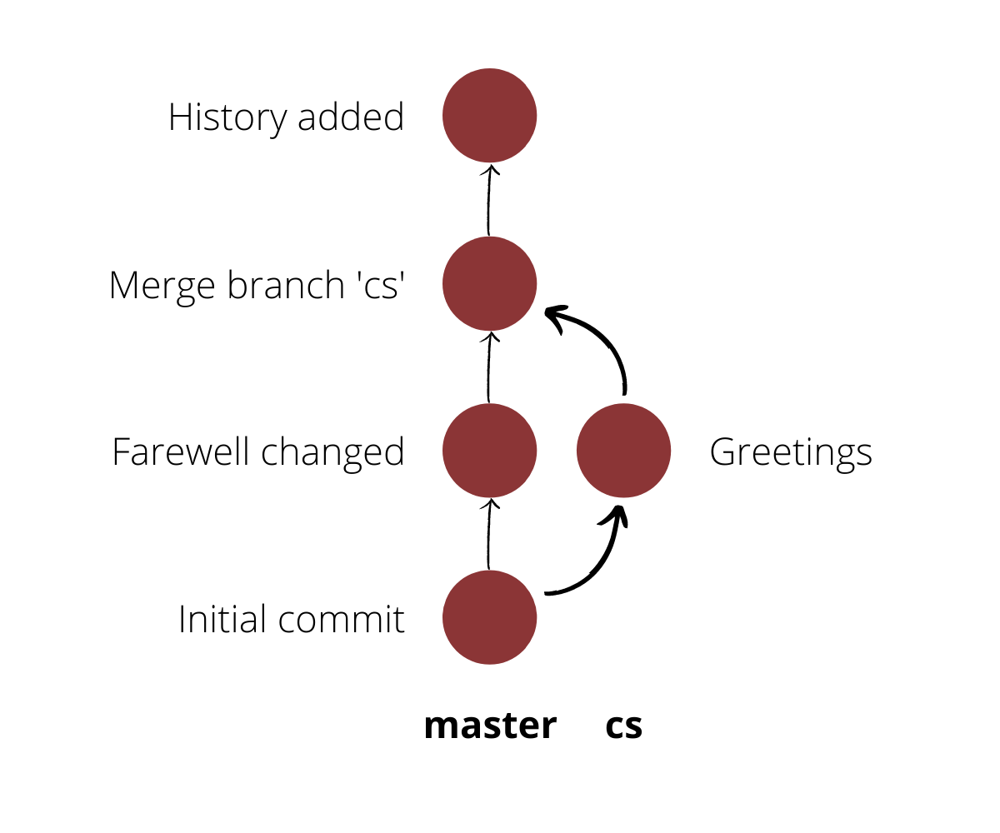

# Narzędzia programisty

## Git

### Zadanie domowe

Pamiętaj, że w razie problemów zamiast męczyć się z gitem i
szukać sposobów na cofnięcie zmian możesz zacząć od początku. Może być
łatwiej 😉

Jeśli cokolwiek jest niezrozumiałe lub trudne - dawaj znać na
Discordzie. Istotą naszych zadań domowych jest to, że często rozszerzają
one tematy omówione podczas wideo. Może się więc tutaj znaleźć coś
nowego i nieznanego. Po prostu pokazujemy prawdziwą pracę programisty od
początku. Nigdy żadne wymagania nie są w 100% jasne i ciągle trzeba
umieć wyszukać potrzebne informacje. Wybacz takie zabiegi, ale po
zakończeniu tego kursu masz umieć myśleć i samodzielnie radzić sobie ze
wszystkim, co dostaniesz w pracy. Głupio byłoby, jeśli po skończeniu
kursu poczujesz, że nikt już nie trzyma rowerka na którym jedziesz i się
wywracasz. Od razu Cię uświadamiamy że czasami puszczamy rowerek już
podczas nauki jazdy 😄

Istotą nauki w Coders School jest też pomoc i współpraca grupowa. Nie
bój się poszukać osoby, z którą razem rozwiążecie te zadania komunikując
się przez Discorda. Możecie przez niego też do siebie zadzwonić i
pogadać! My serio nie sprawdzamy czy ktoś kopiuje czyjąś pracę domową.
Nawet do tego zachęcamy! Na ile sposobów przecież można rozwiązać jedno
zadanie? Rozwiązania będą się powtarzać. Tylko nie rób Ctrl+C i Ctrl+V,
ale powtórz każdy krok samemu, przepisując wszystko ręcznie. Podczas
przepisywania coś zostanie Ci w głowie. To Tobie ma zależeć na nauczeniu
się materiału.

Aha, i użyj proszę komend gita i linuxa w konsoli. Dzięki temu automat CI będzie w stanie sprawdzić Twoje zadanie.

Powodzenia!

#### Część lokalna - tworzenie repo

1. Utwórz katalog o nazwie \"git-majonez\", a w nim utwórz nowe repozytorium gita
2. Utwórz plik main.cpp i napisz w nim program w C++ wyświetlający \"Goodbye World\"
3. Dodaj plik main.cpp i zrób commit o nazwie \"Initial commit\"
4. Zmień kod programu w main.cpp, aby wyświetlał \"Hello World\"
5. Zrób commit z powyższymi zmianami o nazwie \"Farewell changed\"

#### Część zdalna - tworzenie repo na GitHubie

1. Na GitHubie utwórz nowe repozytorium o nazwie \"git-majonez\". Repozytorium musi być publiczne. Nie zaznaczaj żadnych dodatkowych opcji.

    

2. Repozytorium będzie puste. Wyświetli Ci się ekran jak na poniższym obrazku. Jest tam instrukcja co należy zrobić, aby przesłać na GitHuba repozytorium lokalne, które stworzyliśmy. Chodzi nam o punkt \"\... or push an existing repository from the command line\"

    

3. Zgodnie z instrukcją dodaj adres zdalnego repozytorium (`git remote add origin ADDRESS`), ale pomiń tworzenie gałęzi main. Zrób push z i na gałąź master (`git push -u origin master`).

#### Część lokalna - nowa gałąź

1. Utwórz nową gałąź o nazwie \"cs\".
2. Zrób jakąś magię, aby nie było na niej commita o nazwie \"Farewell changed\". Ma być tylko \"Initial commit\" (pytaj na Discordzie lub zobacz u innych albo rozwiń poniżej
   

    
<b>Podpowiedź</b>

    `git reset --hard`

    

3. Na gałęzi \"cs\" zmień kod programu w main.cpp, aby wyświetlał \"Goodbye Coders School\"
4. Zrób commit o nazwie \"Greetings\"

#### Część zdalna - wrzucenie gałęzi

1. Zrób push gałęzi \"cs\" do GitHuba - `git push origin cs`

#### Część lokalna - merge

1. Zrób merge gałęzi \"cs\" do \"master\". W wyniku połączenia program powinien wyświetlać \"Hello Coders School\". Miłego rozwiązywania konfliktów!
2. Historię wpisywanych komend od początku tego zadania wpisz do pliku history.txt i dodaj ten plik do repozytorium w nowym commicie o nazwie \"History added\".

#### Część zdalna - synchronizacja GitHuba

1. Wrzuć obecny stan gałęzi master na GitHuba (`git push`) i upewnij się, że na GitHubie też widać commit z mergem oraz \"History added\"

#### Drzewo commitów

Tak ma wyglądać drzewo commitów po wykonaniu tego zadania

#### Punkty

Za wykonanie zadania dostaniesz +10 XP. Pod uwagę bierzemy 2 rzeczy:

- czy w pliku history.txt znajdują się odpowiednie polecenia
- czy w drzewie są odpowiednie commity

#### Zgłoszenie zadania domowego

1. Zrób Fork repozytorium [coders-school/git-checker](https://github.com/coders-school/git-checker).
2. Do pliku \"homework/address.txt\" wpisz adres swojego repozytorium utworzonego podczas tej pracy domowej w formacie `{user}/{repo}` (np. `ziobron/git-majonez`). Możesz to zrobić na GitHubie lub jeśli chcesz jeszcze trochę poćwiczyć to możesz sklonować tego forka i zrobić to w terminalu. Nie zapomnij wtedy o pushu, aby wysłać zmiany na GitHuba.
3. Zgłoś Pull Request do coders-school/git-checker:master. Zatwierdź sobie puszczenie Workflow (przycisk Approve and Run) i czekaj na wyniki 🙂

W razie problemów lub pytań pisz na Discordzie. Pomożemy!
